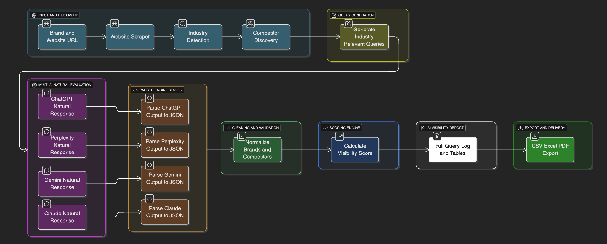
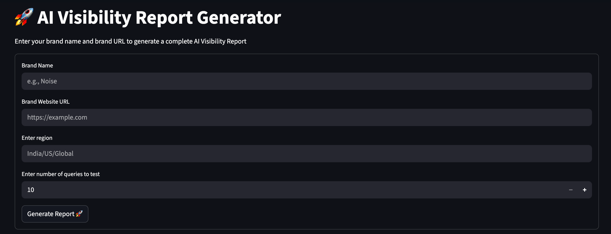
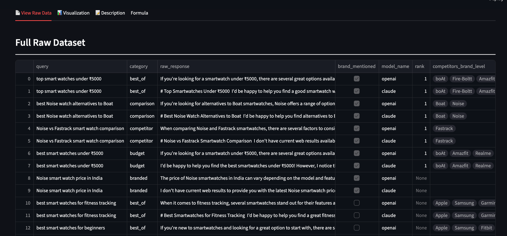
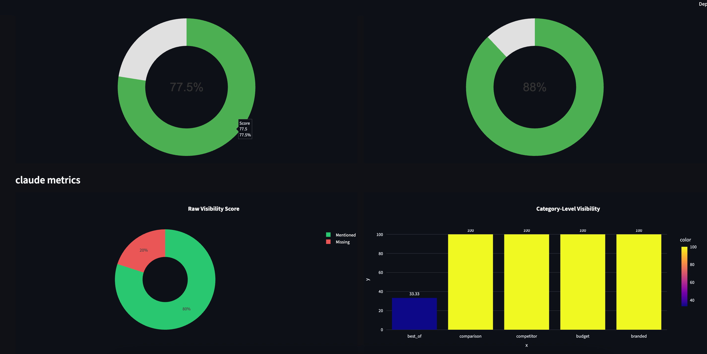

# 🚀 AI Visibility Score – Query Intelligence & Competitor Ranking Engine

## 📌 A. Problem Statement

Brands today generate content across blogs, social media, and product pages — but they rarely *know* how visible they actually are across AI-driven search systems like ChatGPT, Claude, Gemini, Perplexity, etc.

Traditional SEO only covers Google.
But the world has shifted → **AI Search is the new SEO.**

**Problem:**
There is no standardized way for brands to measure:

* How frequently they appear in AI-generated answers
* How they rank against competitors
* Which AI models prefer which competitors
* What types of queries create visibility gaps
* How to strategically optimize AI visibility

This project solves that.

---

## 📌 B. Solution Overview

This system builds an **AI-driven visibility scoring pipeline** that:

### ✅ Generates multi-category queries

(best-of queries, troubleshooting queries, comparison queries, category-intent queries)

### ✅ Fetches AI responses from multiple LLMs

* OpenAI (for all nodes)
* Claude & OpenAI (for comparison ranking)

### ✅ Parses answers using a LangGraph workflow

Every response is broken down into:

* Entities mentioned
* Ranking positions
* Brand sentiment
* Competitor visibility
* Query-level scores

### ✅ Computes a Brand Visibility Score

Based on:

* Frequency of mentions
* Position of mentions
* Query category weightage
* Competitor dominance

### 🎯 Expected Impact

* Brands get a **quantified AI visibility score**
* Clear understanding of **competitor share-of-voice**
* Actionable insights on **content strategy & AI SEO**
* Ability to benchmark over time
* Unlocks a new world of **AI-era search optimization**

---

## 📌 C. Architecture Diagram




---

## 📌 D. Tech Stack

### **Languages**

* Python **3.12.3**

### **Core Libraries**

* `langchain`
* `langgraph~=1.0.3`
* `requests~=2.32.5`
* `beautifulsoup4~=4.14.2`
* `regex`
* `pandas`
* `plotly`
* `streamlit`

### **LLM Integrations**

* `openai~=2.8.1`
* `langchain_openai`
* `langchain-openai~=1.0.3`
* `anthropic` (Claude)
* `google-genai` (Gemini optional)

### **Environment**

* Python virtual environment
* Works on macOS / Linux / Windows

---

## 📌 E. How to Run Your Project

### **1. Clone the repository**

```bash
git clone https://github.com/harsha-bulusu/ai-visibility-score.git
cd T18/ai-visibility-score
```

### **2. Create a virtual environment**

```bash
python3.12 -m venv .venv
source .venv/bin/activate   # macOS/Linux
.venv\Scripts\activate      # Windows
```

### **3. Install dependencies**

```bash
pip install -r requirements.txt
```

### **4. Add your environment variables**

Add API keys in config files `config.py`:

```
OPENAI_API_KEY=your-openai-key
CLAUDE_API_KEY=your-claude-key
```

### **5. Launch app**

```bash
streamlit run app.py
```


## 📌 F. Sample Inputs & Outputs

### **Input**



### **Output (sample)**




---

## 📌 G. Video Demo Link

📺 Add your YouTube or Loom link here:
**👉 <YOUR VIDEO DEMO LINK>**
